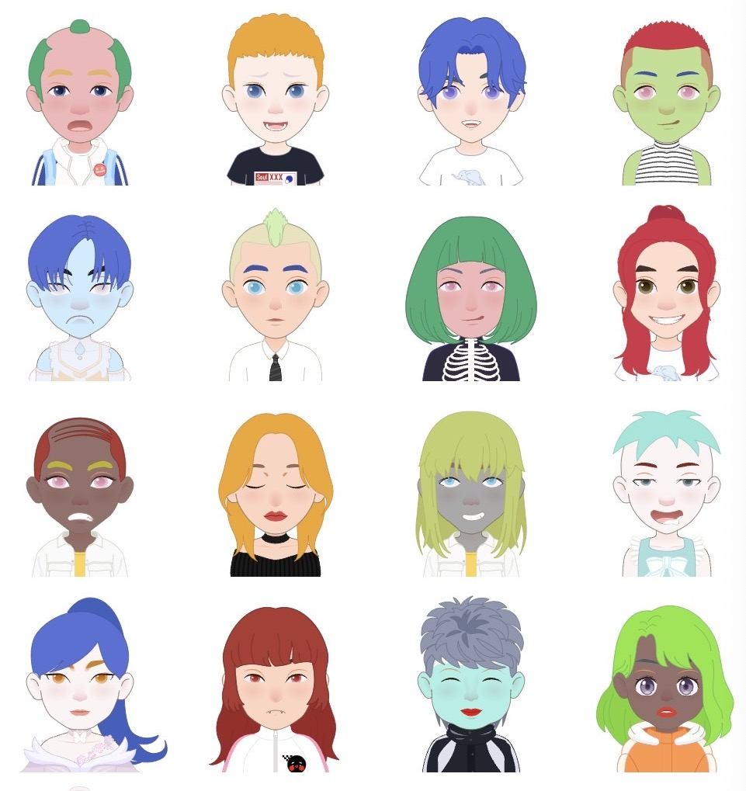
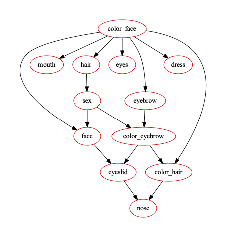
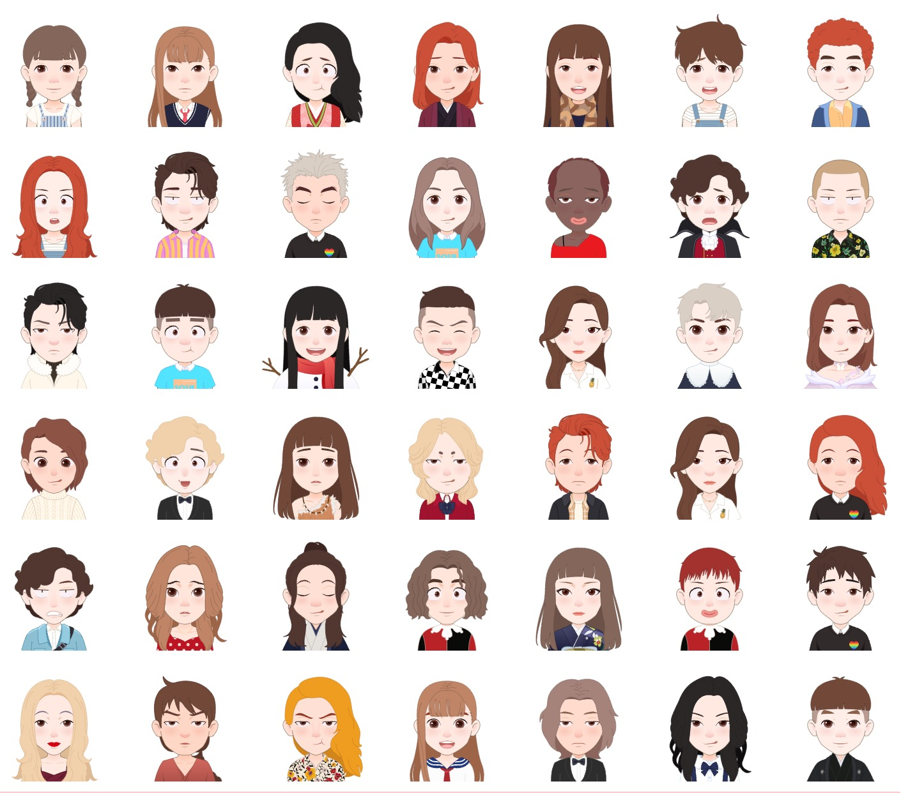
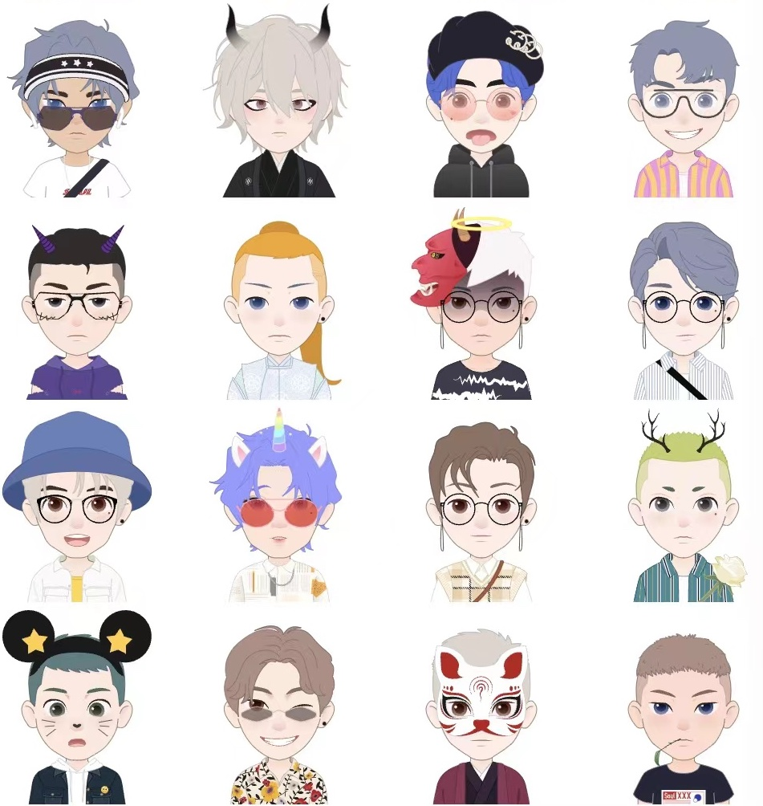

# 如何做一个 AI 捏脸师

最近在网上看了一个社交平台捏头师月入三万的[报道](https://www.sohu.com/a/529801138_116237)，才了解还有这样一个行业

作为程序员打算尝试一下 soul 头像到底能不能通过算法生成一些预选项，提升一下捏脸师的效率。

先用随机数尝试生成了一批，看上去确实惨不忍睹：



仔细思考一下头像的 美 和 和谐 怎么来理解：

头像本质是 五官 发型 及相关颜色和配饰的搭配问题，是一个整体，所以不能说长发还是短发更好看，而应该看互相搭配的是不是合适。

所以搭配的问题，本质上是对相关的概率进行建模，比方说：圆脸配什么样的发型好看 等价于 P(发型|脸型) ，什么样的嘴型和眼型最能突出表情 等价于 P(眼型|嘴型)，然后我就选择了属于生成模型的贝叶斯网络来搭建。

目前一共给了约三万个标注，方法是先标注一些数据升级一下模型，然后生成更多的数据，再标注一次，再升级模型。

训练的贝叶斯网络：




算法网络生成的效果：



官方的示例：



可以看到相对官方的示例，算法生成的头像在表情上更加生动，人设更加多样。

缺点是没有配饰胡子帽子雀斑什么的，因为目前还没有给这些标注数据，因为需要的数据量更大一些，我懒得标注了。


这个算法有一个可能的应用，就是生成 cryptopunk 那种集换式卡牌 NFT


## 如何运行

```
node server.js

streamlit run form.py
```

## 如何把生成的模型，上传到APP上

安装 mitmdump

运行：

```bash
mitmdump -s proxy.py --ssl-insecure -q
```


