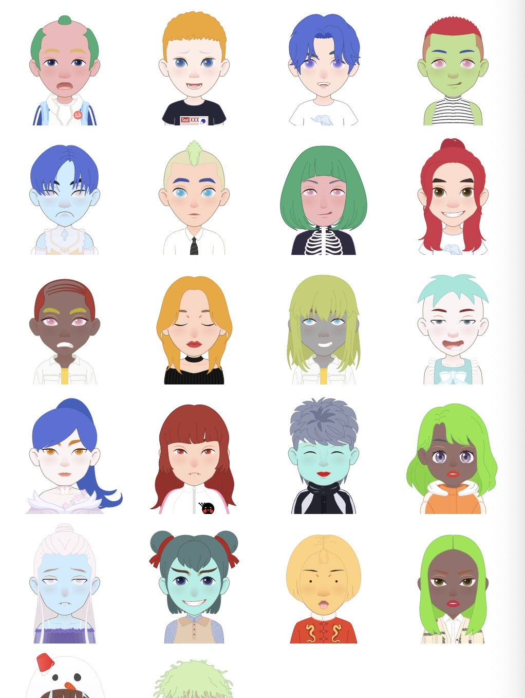
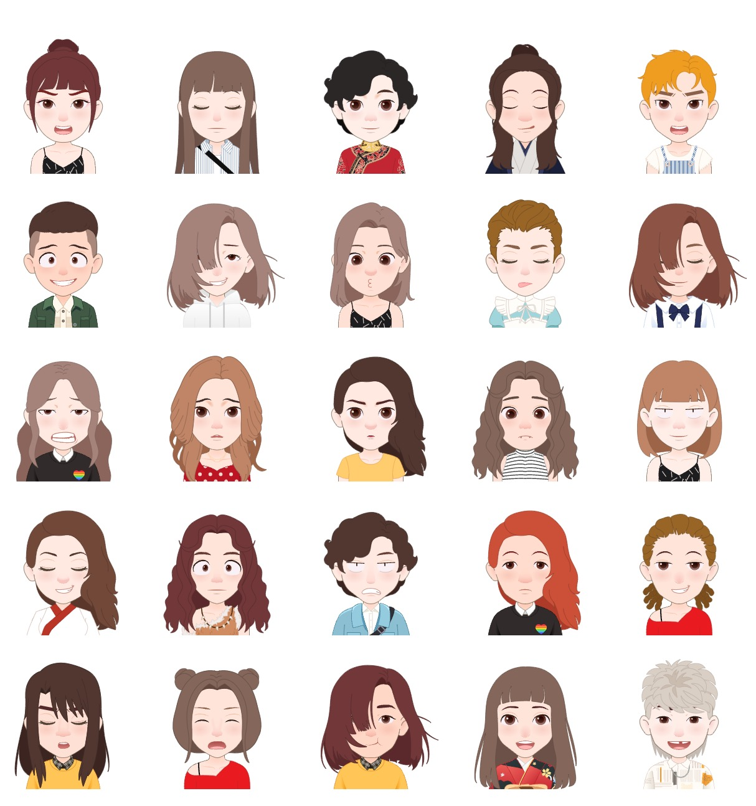
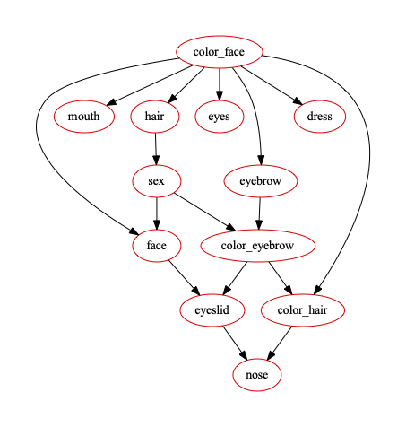

# soul 捏脸的生成系统

在网上看了一个社交平台捏头师月入三万的[报道](https://www.sohu.com/a/529801138_116237)，所以打算尝试一下soul头像能不能通过算法生成。

头像本质是 五官 发型 的相关颜色和配饰的搭配问题，不能说长发还是短发更好看，而应该看互相搭配的好不好。

所以本质上是对相关的概率进行建模 P(发色|发型) P(眼型|嘴型)，选择生成模型贝叶斯网络来搭建。

这是随机数生成的效果：



算法网络生成的效果：



训练的贝叶斯网络：




## 如何运行

```
node server.js

streamlit run form.py
```

## 如何把生成的模型，上传到APP上

安装 mitmdump

运行：

```bash
mitmdump -s proxy.py --ssl-insecure -q
```


